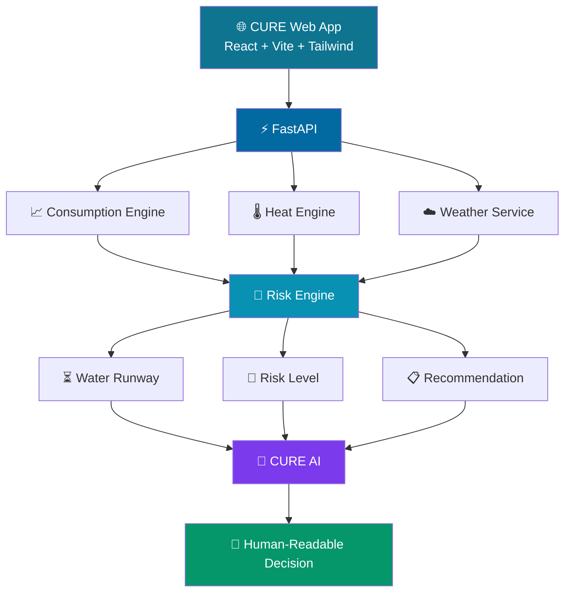

<div align="center">


<br>


<br><br>

<a href="https://github.com/dhanush080607/CURE">
  
</a>

<a href="https://github.com/dhanush080607/CURE">
  
</a>

<br><br>

### 💧 Know your water runway before you run out.

</div>

<a href="https://github.com/dhanush080607/CURE">

</a>

<a href="https://github.com/dhanush080607/CURE">

</a>

<a href="https://github.com/dhanush080607/CURE">

</a>

<br><br>


<br><br>

### 💧 Know your water runway before you run out.

</div>

---

# 🌊 THE IDEA

<div align="center">

## What if a water tank could tell you when it will become a problem?

</div>

**CURE — Climate & Utility Risk Engine** — combines water usage, tank conditions, climate signals, and weather forecasts to estimate how long the current water supply can last.

Instead of asking:

> **"How much water is left?"**

CURE asks:

> **"How long will our current water supply last?"**

### The intelligence pipeline

```text
💧 TANK LEVEL
      +
📈 CONSUMPTION HISTORY
      +
🌡️ HEAT CONDITIONS
      +
☁️ WEATHER FORECAST
      │
      ▼
┌──────────────────────────────┐
│       CURE RISK ENGINE       │
└──────────────┬───────────────┘
               │
               ▼
        ⏳ WATER RUNWAY
               │
       ┌───────┼───────┐
       ▼       ▼       ▼
     🟢 LOW  🟡 WATCH  🔴 HIGH
       │       │       │
     Stable  Monitor   Act
```

---

# ⚡ CURE IN 30 SECONDS

<div align="center">

| 💧 Measure | 📈 Analyze | 🌡️ Adjust | ⏳ Project | 🚦 Act |
| :--------: | :--------: | :--------: | :-------: | :----: |
|    Tank    |    Usage   |    Heat    |   Runway  |  Risk  |
|    Level   |    Trend   |   Impact   |    Days   | Action |

</div>

```text
              ┌─────────────────┐
              │   USER INPUT    │
              └────────┬────────┘
                       ↓
              ┌─────────────────┐
              │ WATER + USAGE   │
              └────────┬────────┘
                       ↓
              ┌─────────────────┐
              │ CLIMATE SIGNALS │
              └────────┬────────┘
                       ↓
              ┌─────────────────┐
              │   RISK ENGINE   │
              └────────┬────────┘
                       ↓
              ┌─────────────────┐
              │ WATER RUNWAY ⏳  │
              └────────┬────────┘
                       ↓
                ┌──────┴──────┐
                ↓             ↓
             🚦 RISK       🤖 AI
                │             │
                └──────┬──────┘
                       ↓
                 ACTIONABLE
                  DECISION
```

---

# 🧠 HOW CURE THINKS

## 01 — 💧 Available Water

CURE first determines how much water is actually available.

```text
Available Water
       =
Tank Capacity × Current Tank Level
```

### Example

```text
50,000 L × 62%
       ↓
31,000 L available
```

---

## 02 — 📈 Consumption Intelligence

CURE analyzes recent daily consumption.

```text
                    CONSUMPTION
                         │
          ┌──────────────┼──────────────┐
          ▼              ▼              ▼
      INCREASING       STABLE       DECREASING
          │              │              │
          ▼              ▼              ▼
       Higher          Normal         Lower
       demand          pattern        demand
```

---

## 03 — 🌡️ Climate Adjustment

Upcoming heat conditions influence projected demand.

|  Condition |    Status   | Adjustment |
| :--------: | :---------: | ---------: |
|  `< 32°C`  |  🟢 NORMAL  |       `0%` |
| `32–<35°C` | 🟡 MODERATE |       `5%` |
| `35–<38°C` | 🟠 ELEVATED |      `10%` |
|  `≥ 38°C`  |   🔴 HIGH   |      `15%` |

> ⚠️ These are **illustrative MVP heuristics**, not scientific constants.

---

## 04 — ⏳ Water Runway

The heart of CURE.

```text
                 AVAILABLE WATER
                        │
                        ▼
                 ┌─────────────┐
                 │      ÷      │
                 └──────┬──────┘
                        │
                        ▼
              PROJECTED DAILY USE
                        │
                        ▼
                 ⏳ WATER RUNWAY
```

> **Water runway = estimated days of supply remaining.**

---

# 🚦 THE CURE RISK SIGNAL

<div align="center">

### 🟢 LOW

```text
━━━━━━━━━━━━━━━━━━━━━━━━━━━━━━━━
        CURRENT SUPPLY
          APPEARS STABLE
━━━━━━━━━━━━━━━━━━━━━━━━━━━━━━━━
```

### 🟡 WATCH

```text
━━━━━━━━━━━━━━━━━━━━━━━━━━━━━━━━
        MONITOR & REVIEW
       TANKER PLANNING SOON
━━━━━━━━━━━━━━━━━━━━━━━━━━━━━━━━
```

### 🔴 HIGH

```text
━━━━━━━━━━━━━━━━━━━━━━━━━━━━━━━━
        ACTION REQUIRED
     PLAN TANKER IMMEDIATELY
━━━━━━━━━━━━━━━━━━━━━━━━━━━━━━━━
```

</div>

---

# 🔥 CLIMATE-AWARE WATER INTELLIGENCE

CURE doesn't treat water availability as a static number.

```text
                    WEATHER
                       │
                       ▼
                 MAX TEMPERATURE
                       │
                       ▼
                  HEAT CONDITIONS
                       │
                       ▼
                 DEMAND ADJUSTMENT
                       │
                       ▼
              PROJECTED DAILY DEMAND
                       │
                       ▼
                  WATER RUNWAY
```

That means the same tank level can produce a different projected runway when environmental conditions change.

---

# 📊 A REAL CURE SCENARIO

<div align="center">

```text
╭──────────────────────────────────────────────╮
│              CURE RISK SNAPSHOT              │
├──────────────────────────────────────────────┤
│                                              │
│   TANK CAPACITY              50,000 L        │
│   CURRENT LEVEL                  62%         │
│   AVAILABLE WATER            31,000 L        │
│                                              │
│   AVG. DAILY USE          7,528.57 L/day     │
│   TEMPERATURE                 30.8°C         │
│   HEAT ADJUSTMENT                0%          │
│                                              │
│   WATER RUNWAY                4.12 DAYS      │
│                                              │
│                  🟢 LOW                      │
│                                              │
╰──────────────────────────────────────────────╯
```

</div>

### System decision

> **Water runway is 4.12 days based on current projected consumption.**

### Recommendation

> **Current water supply appears stable.**

---

# 🧩 ARCHITECTURE



---

# 🤖 AI — BUT WITH GUARDRAILS

CURE deliberately separates **calculation** from **explanation**.

```text
                 REAL DATA
                    │
                    ▼
          ┌───────────────────┐
          │ DETERMINISTIC     │
          │ RISK ENGINE       │
          └─────────┬─────────┘
                    │
                    │ authoritative result
                    ▼
          ┌───────────────────┐
          │      CURE AI      │
          │                   │
          │    Explain        │
          │    Summarize      │
          │    Communicate    │
          └─────────┬─────────┘
                    │
                    ▼
             HUMAN-READABLE
                DECISION
```

## The rule

```text
CALCULATION ≠ GENERATION
```

**The risk engine decides.**

**The AI explains.**

This keeps the environmental calculation deterministic while still giving users a natural-language interface.

---

# 🌐 WEATHER INTELLIGENCE

CURE retrieves forecast information through **Open-Meteo**.

```text
Location
   │
   ▼
Open-Meteo
   │
   ▼
Temperature Forecast
   │
   ▼
Heat Engine
   │
   ▼
Projected Water Demand
   │
   ▼
Water Runway
```

The live forecast values come from the weather service rather than being manually hardcoded into the forecast flow.

---

# 🛠️ TECH STACK

<div align="center">

| Layer              | Technology                  |
| :----------------- | :-------------------------- |
| 🎨 Frontend        | React + Vite + Tailwind CSS |
| 📊 Visualization   | Recharts                    |
| ⚡ Backend          | FastAPI                     |
| 🐍 Language        | Python                      |
| 🧠 AI              | Ollama + llama3.2:3b        |
| 🌦️ Weather        | Open-Meteo                  |
| 🛡️ Validation     | Pydantic                    |
| 🌐 HTTP            | HTTPX                       |
| 🔧 Version Control | Git + GitHub                |

</div>

---

# 🧪 TESTED & VERIFIED

CURE has been tested across multiple operational conditions.

<div align="center">

| Scenario        |  Water Runway |    Result    |
| :-------------- | ------------: | :----------: |
| Normal supply   | **4.12 days** |  🟢 **LOW**  |
| Reduced supply  | **2.99 days** | 🟡 **WATCH** |
| Critical supply | **1.59 days** |  🔴 **HIGH** |
| High heat       | **2.72 days** | 🟡 **WATCH** |

</div>

## Input validation

```text
✓ Negative tank capacity rejected
✓ Tank level > 100% rejected
✓ Negative consumption rejected
✓ Invalid latitude rejected
✓ Invalid longitude rejected
✓ Zero-consumption edge case handled
```

---

# 🖥️ PRODUCT FLOW

```text
                         👤 USER
                           │
                           ▼
                  ┌─────────────────┐
                  │ Enter Tank Data │
                  └────────┬────────┘
                           ▼
                  ┌─────────────────┐
                  │ Add Consumption │
                  └────────┬────────┘
                           ▼
                  ┌─────────────────┐
                  │ Fetch Weather   │
                  └────────┬────────┘
                           ▼
                  ┌─────────────────┐
                  │ Run Risk Engine │
                  └────────┬────────┘
                           ▼
                  ┌─────────────────┐
                  │ Water Runway ⏳ │
                  └────────┬────────┘
                           ▼
                       🚦 RISK
                           │
                 ┌─────────┼─────────┐
                 ▼         ▼         ▼
                🟢        🟡        🔴
                LOW      WATCH      HIGH
                 │         │         │
                 └─────────┼─────────┘
                           ▼
                       🤖 CURE AI
                           │
                           ▼
                    ACTIONABLE
                     DECISION
```

---

# ☁️ AWS & OPEN-SOURCE PHILOSOPHY

CURE follows a **local-first architecture**.

The core environmental intelligence does not depend on a paid cloud account.

The architecture is intentionally modular so infrastructure can evolve independently from the risk engine.

### Design principle

<div align="center">

> **Portable intelligence. Modular infrastructure. Practical environmental impact.**

</div>

The project is designed to integrate with the AWS/open-source ecosystem as the deployment architecture evolves.

---

# 🚀 RUN CURE LOCALLY

## 1. Clone the repository

```bash
git clone https://github.com/dhanush080607/CURE.git
cd CURE
```

---

## 2. Start Ollama

```bash
ollama pull llama3.2:3b
ollama run llama3.2:3b
```

---

## 3. Start the backend

```powershell
cd backend

python -m venv venv

.\venv\Scripts\Activate.ps1

pip install -r requirements.txt

uvicorn app.main:app --reload
```

### Backend

```text
http://127.0.0.1:8000
```

### Swagger API

```text
http://127.0.0.1:8000/docs
```

---

## 4. Start the frontend

Open another terminal:

```powershell
cd frontend

npm install

npm run dev
```

### Frontend

```text
http://localhost:5173
```

---

# 📁 PROJECT STRUCTURE

```text
CURE/
│
├── backend/
│   ├── app/
│   │   ├── ai/
│   │   ├── api/
│   │   ├── risk/
│   │   ├── services/
│   │   └── main.py
│   │
│   └── requirements.txt
│
├── frontend/
│   ├── public/
│   ├── src/
│   │   ├── assets/
│   │   ├── App.jsx
│   │   ├── App.css
│   │   ├── index.css
│   │   └── main.jsx
│   ├── package.json
│   └── vite.config.js
│
├── data/
├── docs/
├── ml/
├── .gitignore
└── README.md
```

---

# 🌍 WHY IT MATTERS

Water scarcity is not only about **how much water exists**.

It is also about:

```text
WHEN
 ↓
WILL
 ↓
THE
 ↓
WATER
 ↓
RUN
 ↓
OUT?
```

CURE tries to answer that question **before the shortage happens**.

### Potential applications

```text
🏠 Homes
   ↓
🏢 Apartments
   ↓
🏫 Schools
   ↓
🏥 Hospitals
   ↓
🏭 Facilities
   ↓
🏙️ Communities
```

---

# 🔮 ROADMAP

### 🟢 CURRENT

* [x] Water runway
* [x] Consumption analysis
* [x] Trend detection
* [x] Heat adjustment
* [x] Weather integration
* [x] Risk classification
* [x] Risk reason
* [x] Recommendations
* [x] Local AI explanation
* [x] Interactive dashboard
* [x] Input validation

### 🟡 NEXT

* [ ] Historical forecasting
* [ ] Smarter demand prediction
* [ ] Tanker requirement estimation
* [ ] Persistent database
* [ ] Multi-tank monitoring
* [ ] Automated alerts

### 🔵 FUTURE

* [ ] IoT tank sensors
* [ ] Real-time monitoring
* [ ] Community water intelligence
* [ ] Water conservation recommendations
* [ ] Municipal dashboards

---

# 🏆 BUILT FOR ENVIRONMENTAL HACKS

<div align="center">


<br><br>

### 🌱 Environmental Intelligence

**Turning climate signals into practical utility decisions.**

</div>

---

# 👥 CONTRIBUTORS

<div align="center">

<a href="https://github.com/dhanush080607">

</a>
&nbsp;&nbsp;&nbsp;
<a href="https://github.com/KCDharshan9">

</a>
&nbsp;&nbsp;&nbsp;
<a href="https://github.com/FaheedBasha123">

</a>

<br>

<b>Dhanush</b>
 •  <b>KCDharshan9</b>
 •  <b>FaheedBasha123</b>

<br><br>


</div>

---

# 📈 PROJECT PULSE

<div align="center">

<a href="https://github.com/dhanush080607/CURE">

</a>

</div>

---

# 🔗 PROJECT LINKS

<div align="center">

<a href="https://github.com/dhanush080607/CURE">

</a>

<a href="https://github.com/dhanush080607/CURE/issues">

</a>

<a href="https://github.com/dhanush080607/CURE/pulls">

</a>

</div>

---

# 💫 THE VISION

<div align="center">

```text
             DATA
               │
               ▼
        ┌──────────────┐
        │ INTELLIGENCE │
        └──────┬───────┘
               │
               ▼
          DECISION
               │
               ▼
            ACTION
               │
               ▼
          🌍 IMPACT
```

<br>

### CURE is not just another dashboard.

### It's a step toward utilities that can **think ahead**.

<br>

### 💧 Predict earlier.

### 🌡️ Understand climate.

### 📊 Use resources smarter.

### 🌍 Act before the shortage.

<br>


<br><br>


</div>
