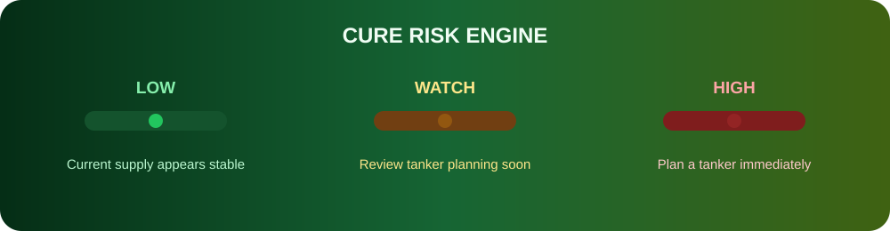
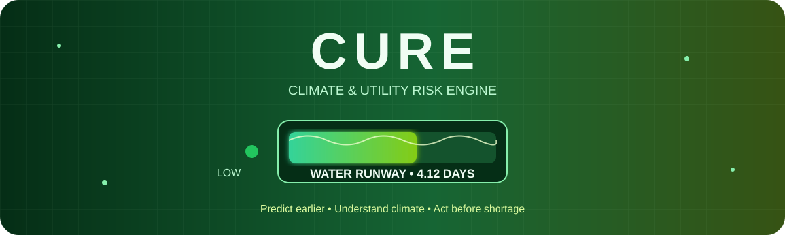
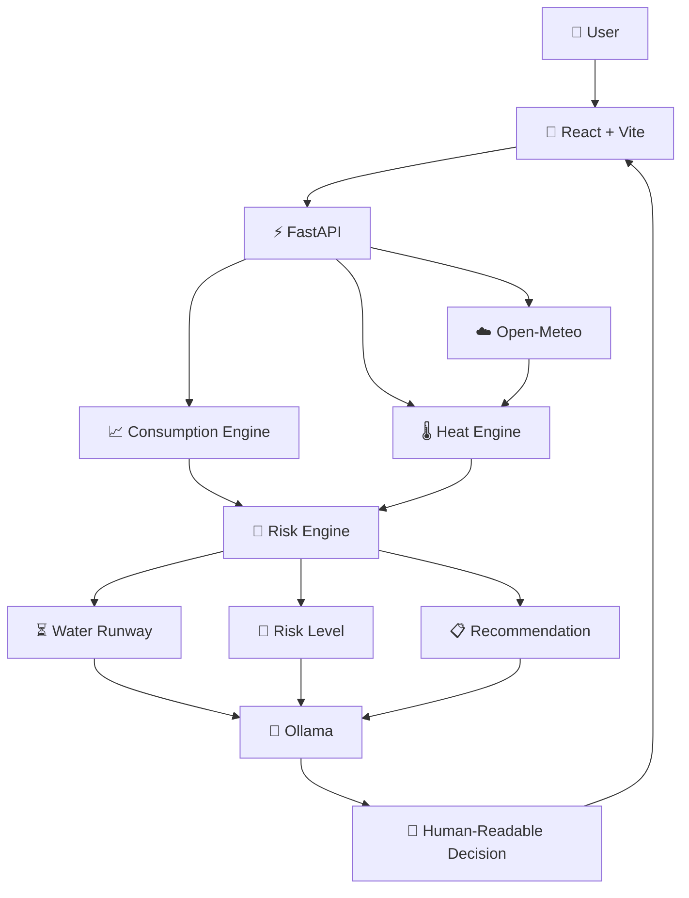
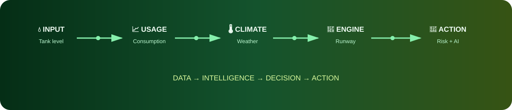

<div align="center">


<br>

[](https://github.com/dhanush080607/CURE)
[](https://react.dev/)
[](https://fastapi.tiangolo.com/)
[](https://www.python.org/)
[](https://ollama.com/)

<br>

**🌿 Climate intelligence for smarter water decisions.**

</div>

---

## 🌊 The Idea

### What if a water tank could tell you when it will become a problem?

CURE — **Climate & Utility Risk Engine** — combines tank level, consumption history, heat conditions, and weather forecasts to estimate how long the current water supply can last.

Instead of asking:

> **"How much water is left?"**

CURE asks:

> **"How long will our current water supply last?"**



---

## ⚡ CURE in 30 Seconds

| Signal | What CURE Uses |
|---|---|
| 💧 Water | Tank capacity + current level |
| 📈 Usage | Recent daily consumption |
| 🌡️ Heat | Maximum forecast temperature |
| ☁️ Weather | Open-Meteo forecast |
| 🧮 Engine | Projected daily consumption |
| ⏳ Output | Water runway in days |
| 🚦 Decision | LOW / WATCH / HIGH |
| 🤖 AI | Human-readable explanation |

---

## 🧠 How CURE Thinks

### 01 · 💧 Available Water

```text
Available Water = Tank Capacity × Current Tank Level %
```

Example:

```text
50,000 L × 62%
       ↓
31,000 L available
```

### 02 · 📈 Consumption Intelligence

```text
                    CONSUMPTION
                         │
          ┌──────────────┼──────────────┐
          ▼              ▼              ▼
      INCREASING       STABLE       DECREASING
          │              │              │
          ▼              ▼              ▼
       Higher          Normal         Lower
       demand          pattern        demand
```

### 03 · 🌡️ Climate Adjustment

| Condition | Status | Adjustment |
|---:|:---:|---:|
| `< 32°C` | 🟢 NORMAL | 0% |
| `32–<35°C` | 🟡 MODERATE | 5% |
| `35–<38°C` | 🟠 ELEVATED | 10% |
| `≥ 38°C` | 🔴 HIGH | 15% |

> These are illustrative MVP heuristics, not scientific constants.

### 04 · ⏳ Water Runway

```text
                 AVAILABLE WATER
                        │
                        ▼
                       ÷
                        │
                        ▼
             PROJECTED DAILY USAGE
                        │
                        ▼
                  WATER RUNWAY
```

**Water runway = estimated days of supply remaining.**

---

## 🚦 Risk Signal



| Runway | Risk | Action |
|---:|:---:|---|
| `≥ 4 days` | 🟢 LOW | Monitor |
| `2–<4 days` | 🟡 WATCH | Review tanker planning |
| `< 2 days` | 🔴 HIGH | Plan tanker immediately |

---

## 🔥 Climate-Aware Water Intelligence

CURE does not treat water availability as a static number.

```text
                 WEATHER FORECAST
                         │
                         ▼
                 MAX TEMPERATURE
                         │
                         ▼
                  HEAT CONDITION
                         │
                         ▼
                  DEMAND CHANGE
                         │
                         ▼
              PROJECTED DAILY USAGE
                         │
                         ▼
                   WATER RUNWAY
```

The same tank level can produce a different projected runway when environmental conditions change.

---

## 📊 Real CURE Scenario

```text
┌──────────────────────────────────────────────┐
│               CURE SNAPSHOT                  │
├──────────────────────────────────────────────┤
│                                              │
│  Tank Capacity              50,000 L         │
│  Current Level                   62%         │
│  Available Water             31,000 L        │
│                                              │
│  Avg. Daily Usage          7,528.57 L/day    │
│  Temperature                  30.8°C         │
│  Heat Adjustment                  0%         │
│                                              │
│  Water Runway                4.12 days       │
│  Risk                         🟢 LOW          │
│                                              │
└──────────────────────────────────────────────┘
```

**System decision:** Water runway is **4.12 days** based on current projected consumption.

**Recommendation:** Current water supply appears stable.

---

## 🏗️ Architecture



---

## 🤖 AI With Guardrails

CURE separates **calculation** from **explanation**.

```text
REAL DATA
    │
    ▼
┌───────────────────────┐
│  DETERMINISTIC        │
│  RISK ENGINE          │
│                       │
│  Water runway         │
│  Risk level           │
│  Risk reason          │
│  Recommendation       │
└───────────┬───────────┘
            │
            ▼
┌───────────────────────┐
│       CURE AI         │
│                       │
│ Explain               │
│ Summarize             │
│ Communicate           │
└───────────┬───────────┘
            │
            ▼
     HUMAN DECISION
```

### Core principle

```text
CALCULATION ≠ GENERATION
```

**The risk engine decides. The AI explains.**

---

## 🛠️ Technology Stack

| Layer | Technology |
|---|---|
| 🎨 Frontend | React + Vite |
| 🎨 Styling | Tailwind CSS |
| 📊 Charts | Recharts |
| ⚡ Backend | FastAPI |
| 🐍 Language | Python |
| 🤖 AI | Ollama + llama3.2:3b |
| 🌦️ Weather | Open-Meteo |
| 🛡️ Validation | Pydantic |
| 🌐 HTTP | HTTPX |
| 🔧 Version Control | Git + GitHub |

---

## 🧪 Tested Scenarios

| Scenario | Runway | Result |
|---|---:|:---:|
| Normal supply | **4.12 days** | 🟢 LOW |
| Reduced supply | **2.99 days** | 🟡 WATCH |
| Critical supply | **1.59 days** | 🔴 HIGH |
| High heat | **2.72 days** | 🟡 WATCH |

### Validation

```text
✓ Negative tank capacity rejected
✓ Tank level above 100% rejected
✓ Negative consumption rejected
✓ Invalid latitude rejected
✓ Invalid longitude rejected
✓ Zero-consumption scenario handled
✓ Weather request validated
✓ Risk result generated successfully
```

---

## 🚀 Run Locally

### 1. Clone

```bash
git clone https://github.com/dhanush080607/CURE.git
cd CURE
```

### 2. Start Ollama

```bash
ollama pull llama3.2:3b
ollama run llama3.2:3b
```

### 3. Backend

```powershell
cd backend
python -m venv venv
.env\Scripts\Activate.ps1
pip install -r requirements.txt
uvicorn app.main:app --reload
```

API:

```text
http://127.0.0.1:8000
```

Swagger:

```text
http://127.0.0.1:8000/docs
```

### 4. Frontend

Open another terminal:

```powershell
cd frontend
npm install
npm run dev
```

Frontend:

```text
http://localhost:5173
```

---

## 📁 Project Structure

```text
CURE/
│
├── backend/
│   ├── app/
│   │   ├── ai/
│   │   ├── api/
│   │   ├── risk/
│   │   ├── services/
│   │   └── main.py
│   │
│   └── requirements.txt
│
├── frontend/
│   ├── public/
│   ├── src/
│   │   ├── assets/
│   │   ├── App.jsx
│   │   ├── App.css
│   │   ├── index.css
│   │   └── main.jsx
│   ├── package.json
│   └── vite.config.js
│
├── data/
├── docs/
├── ml/
├── assets/
│   ├── cure-header.svg
│   ├── cure-risk.svg
│   ├── cure-flow.svg
│   └── cure-footer.svg
│
├── .gitignore
└── README.md
```

---

## ☁️ AWS & Open-Source Philosophy

CURE follows a **local-first architecture**.

The core environmental intelligence can run locally without requiring a paid cloud account.

The architecture is intentionally modular so deployment infrastructure can evolve independently from the risk engine.

> **Portable intelligence. Modular infrastructure. Practical environmental impact.**

---

## 🌍 Why CURE?

Water scarcity is not only about **how much water exists**.

It is also about **when it will run out**.

```text
          HOW MUCH?
              │
              ▼
           TODAY
              │
              ▼
          ┌───────┐
          │ CURE  │
          └───┬───┘
              │
              ▼
         HOW LONG?
              │
              ▼
       ⏳ WATER RUNWAY
```

### Potential applications

```text
🏠 Homes
   │
   ├── 🏢 Apartments
   ├── 🏫 Schools
   ├── 🏥 Hospitals
   ├── 🏭 Facilities
   └── 🏙️ Communities
```

---

## 🔮 Roadmap

### 🟢 Current

- [x] Water runway
- [x] Consumption analysis
- [x] Trend detection
- [x] Heat adjustment
- [x] Weather integration
- [x] Risk classification
- [x] Risk reason
- [x] Recommendations
- [x] Local AI explanation
- [x] Interactive dashboard
- [x] Input validation

### 🟡 Next

- [ ] Historical forecasting
- [ ] Smarter demand prediction
- [ ] Tanker requirement estimation
- [ ] Persistent database
- [ ] Multi-tank monitoring
- [ ] Automated alerts

### 🔵 Future

- [ ] IoT tank sensors
- [ ] Real-time monitoring
- [ ] Community water intelligence
- [ ] Water conservation recommendations
- [ ] Municipal dashboards

---

## 👥 Contributors

<div align="center">

<a href="https://github.com/dhanush080607">

</a>
&nbsp;&nbsp;
<a href="https://github.com/KCDharshan9">

</a>
&nbsp;&nbsp;
<a href="https://github.com/FaheedBasha123">

</a>

<br><br>

**Dhanush** • **KCDharshan9** • **FaheedBasha123**

<br><br>


</div>

---

## 🏆 Built For Environmental Hacks 2026

<div align="center">


<br><br>

**🌱 Turning climate signals into practical utility decisions.**

</div>

---

<div align="center">



<br>

**CURE — Climate & Utility Risk Engine**

**Think ahead. Act before the shortage. 🌿**

</div>
