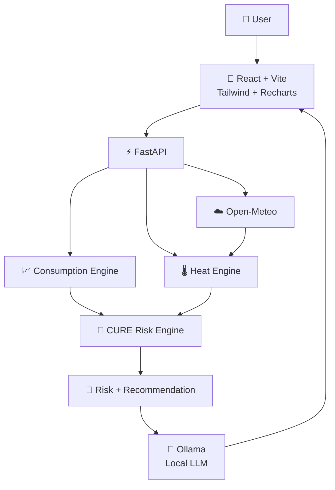

<div align="center">

# 🌿 CURE

### Climate & Utility Risk Engine

**Predict water shortages before they become emergencies.**

<br>

[](https://github.com/dhanush080607/CURE)
[](https://react.dev/)
[](https://fastapi.tiangolo.com/)
[](https://www.python.org/)
[](https://ollama.com/)

<br>

[](https://github.com/dhanush080607/CURE/stargazers)
[](https://github.com/dhanush080607/CURE/commits/main)
[](https://github.com/dhanush080607/CURE/issues)

<br><br>

> 🌍 **Climate signals → Water intelligence → Better decisions**

</div>

---

## 🌱 The Problem

Water management often answers one simple question:

> **How much water do we have right now?**

But that isn't enough.

A tank may look healthy today while increasing consumption and rising temperatures could reduce its remaining supply much faster than expected.

### CURE asks a better question:

> **⏳ How long will our current water supply last?**

---

## 🧭 What CURE Does

```text
┌───────────────────────────────────────────────────────────┐
│                         CURE                              │
│              CLIMATE & UTILITY RISK ENGINE               │
├───────────────────────────────────────────────────────────┤
│                                                           │
│   💧 Tank       📈 Consumption      🌡️ Climate           │
│   Level         History             Conditions            │
│      │               │                   │                │
│      └───────────────┼───────────────────┘                │
│                      ▼                                    │
│               ┌──────────────┐                            │
│               │  RISK ENGINE │                            │
│               └───────┬──────┘                            │
│                       ▼                                   │
│                ⏳ WATER RUNWAY                            │
│                       │                                   │
│             ┌─────────┼─────────┐                         │
│             ▼         ▼         ▼                         │
│           🟢 LOW   🟡 WATCH   🔴 HIGH                    │
│             │         │         │                         │
│          Monitor   Review      Act                        │
│                                                           │
└───────────────────────────────────────────────────────────┘
```

---

# ⚡ CURE AT A GLANCE

| Signal      | What CURE Uses                |
| ----------- | ----------------------------- |
| 💧 Water    | Tank capacity + current level |
| 📈 Usage    | Recent daily consumption      |
| 🌡️ Heat    | Maximum forecast temperature  |
| ☁️ Weather  | Open-Meteo forecast           |
| 🧮 Engine   | Projected daily consumption   |
| ⏳ Output    | Water runway in days          |
| 🚦 Decision | LOW / WATCH / HIGH            |
| 🤖 AI       | Human-readable explanation    |

---

# 🧠 How CURE Thinks

## 01 · 💧 Calculate Available Water

```text
Available Water
       │
       ▼
Tank Capacity × Current Level %
       │
       ▼
Water Available
```

### Example

```text
50,000 L × 62%
        │
        ▼
31,000 L
```

---

## 02 · 📈 Understand Consumption

CURE analyzes recent daily usage.

```text
                    RECENT USAGE
                         │
             ┌───────────┼───────────┐
             ▼           ▼           ▼
        INCREASING      STABLE     DECREASING
             │           │           │
             ▼           ▼           ▼
         Higher       Consistent     Lower
         demand         usage        demand
```

---

## 03 · 🌡️ Account for Heat

CURE applies an **illustrative MVP heat heuristic** to projected demand.

| Temperature | Heat Status | Demand Adjustment |
| ----------: | :---------: | ----------------: |
|    `< 32°C` |  🟢 NORMAL  |                0% |
|  `32–<35°C` | 🟡 MODERATE |                5% |
|  `35–<38°C` | 🟠 ELEVATED |               10% |
|    `≥ 38°C` |   🔴 HIGH   |               15% |

> **Note:** These percentages are prototype heuristics, not scientific or medical thresholds.

---

# ⏳ The Water Runway

The core CURE metric is the estimated number of days the available supply can support projected daily usage.

```text
                 AVAILABLE WATER
                        │
                        ▼
                       ÷
                        │
                        ▼
             PROJECTED DAILY USAGE
                        │
                        ▼
                 ┌─────────────┐
                 │   RUNWAY    │
                 │             │
                 │  4.12 DAYS  │
                 └─────────────┘
```

### Why runway matters

A tank percentage alone doesn't tell the whole story.

```text
Tank A → 60% → LOW usage  → Longer runway
Tank B → 60% → HIGH usage → Shorter runway
```

Same tank level.

Different future.

---

# 🚦 Risk Engine

<div align="center">

### 🟢 LOW

**Current water supply appears stable.**

<br>

### 🟡 WATCH

**Review tanker planning soon.**

<br>

### 🔴 HIGH

**Plan a tanker immediately.**

</div>

### Decision logic

```text
                    WATER RUNWAY
                         │
             ┌───────────┼───────────┐
             ▼           ▼           ▼
           ≥ 4 days    2–<4 days    < 2 days
             │           │           │
             ▼           ▼           ▼
          🟢 LOW      🟡 WATCH     🔴 HIGH
```

---

# 🔥 Climate-Aware Intelligence

CURE does not treat water as a static resource.

```text
                 WEATHER FORECAST
                         │
                         ▼
                 MAX TEMPERATURE
                         │
                         ▼
                  HEAT CONDITION
                         │
                         ▼
                  DEMAND CHANGE
                         │
                         ▼
              PROJECTED DAILY USAGE
                         │
                         ▼
                   WATER RUNWAY
```

This allows the system to account for environmental conditions when projecting future demand.

---

# 📊 Real CURE Scenario

```text
┌──────────────────────────────────────────────┐
│               CURE SNAPSHOT                  │
├──────────────────────────────────────────────┤
│                                              │
│  Tank Capacity              50,000 L         │
│  Current Level                   62%         │
│  Available Water             31,000 L        │
│                                              │
│  Avg. Daily Usage          7,528.57 L/day    │
│  Temperature                  30.8°C         │
│  Heat Adjustment                  0%         │
│                                              │
│  Water Runway                4.12 days       │
│                                              │
│  Risk                         🟢 LOW          │
│                                              │
└──────────────────────────────────────────────┘
```

### System decision

> Water runway is **4.12 days** based on current projected consumption.

### Recommendation

> **Current water supply appears stable.**

---

# 🏗️ Architecture



---

# 🤖 AI With Guardrails

CURE intentionally separates **decision-making** from **language generation**.

```text
┌───────────────────────┐
│       REAL DATA       │
└───────────┬───────────┘
            │
            ▼
┌───────────────────────┐
│   DETERMINISTIC       │
│     RISK ENGINE       │
│                       │
│ • Water runway        │
│ • Risk level          │
│ • Risk reason         │
│ • Recommendation      │
└───────────┬───────────┘
            │
            │ authoritative result
            ▼
┌───────────────────────┐
│       CURE AI         │
│                       │
│ Explain               │
│ Summarize             │
│ Communicate           │
└───────────┬───────────┘
            │
            ▼
┌───────────────────────┐
│  HUMAN-READABLE       │
│      DECISION         │
└───────────────────────┘
```

## Core principle

```text
CALCULATION ≠ GENERATION
```

**The risk engine decides.**

**The AI explains.**

This keeps the core environmental calculation deterministic while using AI as the communication layer.

---

# 🌦️ Weather Intelligence

CURE uses **Open-Meteo** for forecast data.

```text
Location
   │
   ▼
Open-Meteo
   │
   ▼
Temperature Forecast
   │
   ▼
Heat Engine
   │
   ▼
Projected Demand
   │
   ▼
Water Runway
```

The live forecast is retrieved from the weather service rather than manually entering forecast temperatures.

---

# 🛠️ Technology Stack

<div align="center">

| Layer              | Technology           |
| :----------------- | :------------------- |
| 🎨 Frontend        | React + Vite         |
| 🎨 Styling         | Tailwind CSS         |
| 📊 Charts          | Recharts             |
| ⚡ Backend          | FastAPI              |
| 🐍 Language        | Python               |
| 🤖 AI              | Ollama + llama3.2:3b |
| 🌦️ Weather        | Open-Meteo           |
| 🛡️ Validation     | Pydantic             |
| 🌐 HTTP            | HTTPX                |
| 🔧 Version Control | Git + GitHub         |

</div>

---

# 🧪 Tested Scenarios

CURE has been tested against multiple operational scenarios.

| Scenario        |        Runway |  Result  |
| --------------- | ------------: | :------: |
| Normal supply   | **4.12 days** |  🟢 LOW  |
| Reduced supply  | **2.99 days** | 🟡 WATCH |
| Critical supply | **1.59 days** |  🔴 HIGH |
| High heat       | **2.72 days** | 🟡 WATCH |

---

## ✅ Validation

```text
✓ Negative tank capacity rejected

✓ Tank level above 100% rejected

✓ Negative consumption rejected

✓ Invalid latitude rejected

✓ Invalid longitude rejected

✓ Zero-consumption scenario handled

✓ Weather request validated

✓ Risk result generated successfully
```

---

# 🖥️ PRODUCT FLOW

```text
             👤 USER
                │
                ▼
       ┌─────────────────┐
       │   Tank Inputs   │
       └────────┬────────┘
                ▼
       ┌─────────────────┐
       │ Usage History   │
       └────────┬────────┘
                ▼
       ┌─────────────────┐
       │ Weather Fetch   │
       └────────┬────────┘
                ▼
       ┌─────────────────┐
       │  Risk Engine    │
       └────────┬────────┘
                ▼
       ┌─────────────────┐
       │ Water Runway ⏳ │
       └────────┬────────┘
                ▼
           ┌────┴────┐
           ▼         ▼
        🚦 RISK    🤖 AI
           │         │
           └────┬────┘
                ▼
       ┌─────────────────┐
       │    DECISION     │
       └─────────────────┘
```

---

# ☁️ AWS & OPEN-SOURCE

CURE uses a **local-first architecture**.

The environmental calculation and AI explanation can run locally without requiring a paid cloud account.

The system is intentionally modular so deployment infrastructure can evolve independently from the core risk engine.

### Design philosophy

```text
Portable Intelligence
        +
Modular Infrastructure
        +
Practical Environmental Impact
        =
             CURE
```

The project is designed with future AWS/open-source deployment in mind.

---

# 🚀 RUN LOCALLY

## 1. Clone

```bash
git clone https://github.com/dhanush080607/CURE.git
cd CURE
```

---

## 2. Start Ollama

Make sure Ollama is installed and running.

```bash
ollama pull llama3.2:3b
ollama run llama3.2:3b
```

---

## 3. Start the backend

Open a terminal:

```powershell
cd backend

python -m venv venv

.\venv\Scripts\Activate.ps1

pip install -r requirements.txt

uvicorn app.main:app --reload
```

### API

```text
http://127.0.0.1:8000
```

### Swagger

```text
http://127.0.0.1:8000/docs
```

---

## 4. Start the frontend

Open another terminal:

```powershell
cd frontend

npm install

npm run dev
```

### Frontend

```text
http://localhost:5173
```

---

# 📁 PROJECT STRUCTURE

```text
CURE/
│
├── backend/
│   ├── app/
│   │   ├── ai/
│   │   ├── api/
│   │   ├── risk/
│   │   ├── services/
│   │   └── main.py
│   │
│   └── requirements.txt
│
├── frontend/
│   ├── public/
│   ├── src/
│   │   ├── assets/
│   │   ├── App.jsx
│   │   ├── App.css
│   │   ├── index.css
│   │   └── main.jsx
│   │
│   ├── package.json
│   └── vite.config.js
│
├── data/
├── docs/
├── ml/
├── .gitignore
└── README.md
```

---

# 🌍 WHY CURE?

Water scarcity is not simply a question of quantity.

It's a question of **time**.

```text
          HOW MUCH?
              │
              ▼
           TODAY
              │
              ▼
         ┌─────────┐
         │   CURE  │
         └────┬────┘
              │
              ▼
          HOW LONG?
              │
              ▼
        ⏳ WATER RUNWAY
```

### Potential applications

```text
🏠 Homes
   │
   ├── 🏢 Apartments
   │
   ├── 🏫 Schools
   │
   ├── 🏥 Hospitals
   │
   ├── 🏭 Facilities
   │
   └── 🏙️ Communities
```

---

# 🔮 ROADMAP

## 🟢 Current

* [x] Water runway
* [x] Consumption analysis
* [x] Consumption trend
* [x] Heat adjustment
* [x] Weather integration
* [x] Risk classification
* [x] Risk reason
* [x] Recommendations
* [x] Local AI explanation
* [x] Interactive dashboard
* [x] Input validation

## 🟡 Next

* [ ] Historical forecasting
* [ ] Smarter demand prediction
* [ ] Tanker requirement estimation
* [ ] Persistent database
* [ ] Multi-tank monitoring
* [ ] Automated alerts

## 🔵 Future

* [ ] IoT tank sensors
* [ ] Real-time monitoring
* [ ] Community water intelligence
* [ ] Water conservation recommendations
* [ ] Municipal dashboards

---

# 🏆 ENVIRONMENTAL HACKS 2026

<div align="center">


<br><br>

### 🌱 Built around environmental intelligence

**Turning climate signals into practical utility decisions.**

</div>

---

# 👥 CONTRIBUTORS

<div align="center">

<a href="https://github.com/dhanush080607">

</a>

    

<a href="https://github.com/KCDharshan9">

</a>

    

<a href="https://github.com/FaheedBasha123">

</a>

<br><br>

**Dhanush**  •  **KCDharshan9**  •  **FaheedBasha123**

<br><br>


</div>

---

# 📊 GITHUB

<div align="center">

[](https://github.com/dhanush080607/CURE)

[](https://github.com/dhanush080607/CURE/issues)

[](https://github.com/dhanush080607/CURE/pulls)

</div>

---

# 💚 THE VISION

<div align="center">

```text
                 DATA
                  │
                  ▼
           ┌─────────────┐
           │ INTELLIGENCE│
           └──────┬──────┘
                  │
                  ▼
              DECISION
                  │
                  ▼
                ACTION
                  │
                  ▼
             🌍 IMPACT
```

<br>

## CURE is not just another dashboard.

### It's a step toward utilities that can **think ahead**.

<br>

**💧 Predict earlier.**

**🌡️ Understand climate.**

**📊 Use resources smarter.**

**🌍 Act before the shortage.**

<br>

---

### Built with purpose. Designed for impact. 🌱

**CURE — Climate & Utility Risk Engine**

</div>
